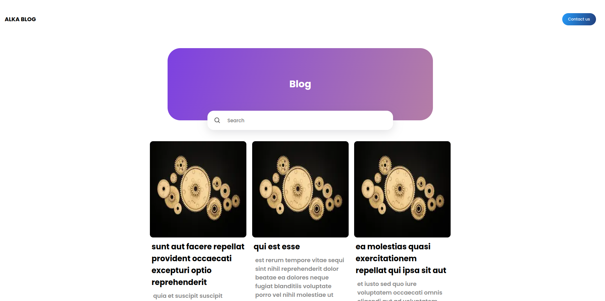
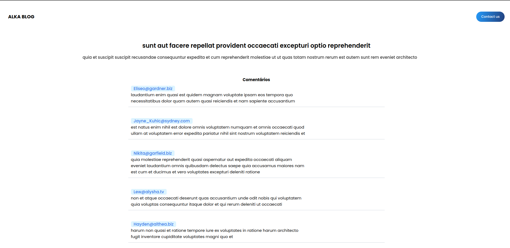

## Project Name & Pitch

Blog test

###  Demo : https://blog-test-zeta-liart.vercel.app/

Um blog que consulta postagens e comentários por meio de uma API restfull.

## Status do projeto
(desenvolvimento concluido)

Este projeto está atualmente em desenvolvimento. Os usuários podem visualizar postagens, podem ler na área de postagem lida, podem usar a pesquisa para encontrar títulos semelhantes e podem visualizar comentários para cada postagem.

## Capturas de tela do projeto
  

### Tecnologias utilizadas

- Next.js
- React
- Hooks
- Axios

### Ilustrativo

- cabeçalho meramente ilustrativo
- imagem meramente ilustrativa

## Instruções de instalação e configuração

#### Exemplo:  

Clone este repositório. Você precisará de `node` e `yarn` instalados globalmente em sua máquina. 

Installation:

`yarn`  

To Start Dev:

`yarn dev` 

OR

To Start Build:

`yarn build`  

To Start:

`yarn start`  

To Visit App:

`localhost:3000/`  

